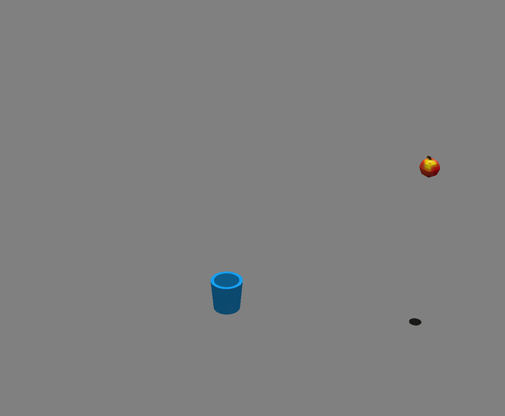

# Catch them apples

Author: Denise Yang

Design: A 3D apple catcher that's impossibly tedious :)

Screen Shot:

How To Play:
Use WASD to move the bin around. Can you catch 255 apples?

This game was built with [NEST](NEST.md). All assets created in Blender.
